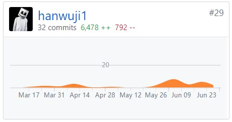

#自学的感悟与理解
在自学的过程中我收获了很多，其中我有做的好的地方，也有差的地方。在这个结尾，好好总结下。
####好的方面：
1.耐心  2.敢于挑战自己的缺点  3.跳出了舒适圈
####差的方面：
1.拖延症（自己好好想想根源，并解决。我当初是因为经常模仿，导致后面看都看不懂，感觉这事没意义，从而缺乏动力。后面与其他同学以及辅导员沟通后解决了这个问题，让我知道了做这事的意义，编程是门手艺，强调的就是要去多用，先拓展再深挖）  2.喜欢钻牛角尖（其实凡事喜欢问为什么，有不懂的就问，自然是好的。但在自学中是要懂得做事要分轻重，当下紧急任务是什么，就先完成它，影响进度的列为重要的，不影响进度的问题就记录下来，后面再解决）

##感想：
从一天的兴奋到第五天的消沉再到第十天的成就感，很好的诠释了耐心为什么对于自学来说很重要
####在自学方面只字不差的阅读是项很重要的技能，但注意最好是用过后
当然第一遍阅读《自学是门手艺》这本书的时候还是要囫囵吞枣，因为前期有太多过早引用的知识，会让你花太多精力时间。
在入门营任务完成后再来回顾《自学是门手艺》，你会发现它里面有很多你需要补充的知识，而在任务中你都用过了。从而
这些知识自然很容易就吸收了。想想要是再开始就死磕那些知识的话，你会怎么样？也许早就放弃了罢

####沟通
在学习的过程中，我们也许会有各种各样的问题，不一定是技术方面，还有学习方法.心态方面。这些问题都需要通过与其他
志同道合的人沟通才能顺利的度过这个成长期。我就是一个活生生的例子，鄙人性格内向，在沟通方面

####先拓展再深挖
模仿(前提是要会记录问题)本身就是一种很好的拓展手段，不影响进度的问题在后面可以深挖的时候可以得到很好的解决，因为这部分问题大都来自“过早引用”
在此附上我的奋斗史

像我这样拖了几个月的估计也没几个人了，哈哈。学完后神清气爽。忠告：最好是在一块时间内集中完成最好了

####自学能力
在这个过程中，明显感觉到了自己自学能力的变化，也发现了自身许多的问题。

最后感谢
一路陪伴的糖总总，老白，张教练，蔡教练！