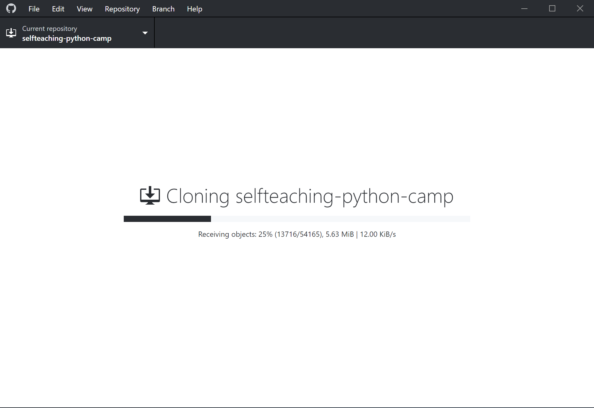
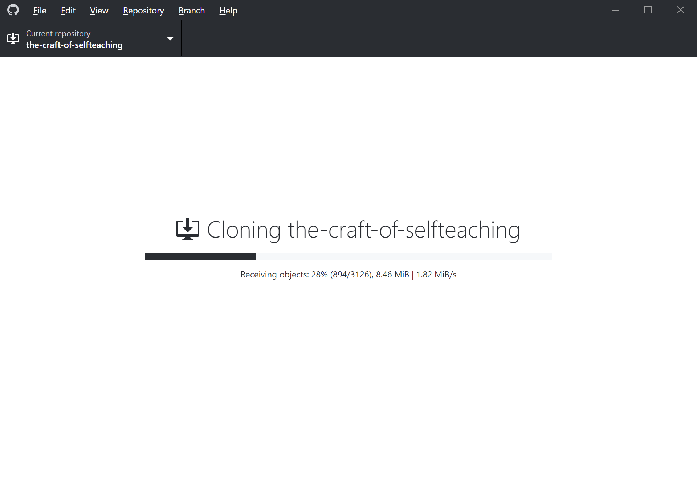

# Python 自学训练营 010 期 沈璜 日志

**学员信息**

- 姓名：沈璜
- 学号：1901100244
- 系统：Windows 10 version 1903 (64-bit)
- 职业：新闻学在读硕士研究生
- 简介：以前当过 10 年高中教师，因为觉得已经遇到了职业天花板，就参加了国家统招硕士研究生考试，读了全日制的硕士研究生，还有 1 年毕业，现在正在硕士论文写作阶段。关注笑来老师十多年了，对老师思考后的结论深表认同，故而借这个机会学习一下 Python。希望学完之后应用在论文写作等场景里。

**目录**

- [Python 自学训练营 010 期 沈璜 日志](#python-%e8%87%aa%e5%ad%a6%e8%ae%ad%e7%bb%83%e8%90%a5-010-%e6%9c%9f-%e6%b2%88%e7%92%9c-%e6%97%a5%e5%bf%97)
  - [DAY 00](#day-00)
    - [1. 学习内容](#1-%e5%ad%a6%e4%b9%a0%e5%86%85%e5%ae%b9)
    - [2. 学习用时](#2-%e5%ad%a6%e4%b9%a0%e7%94%a8%e6%97%b6)
    - [3. 收获总结](#3-%e6%94%b6%e8%8e%b7%e6%80%bb%e7%bb%93)
    - [4. 遇到的难点与问题](#4-%e9%81%87%e5%88%b0%e7%9a%84%e9%9a%be%e7%82%b9%e4%b8%8e%e9%97%ae%e9%a2%98)
      - [4.1 网络环境](#41-%e7%bd%91%e7%bb%9c%e7%8e%af%e5%a2%83)
      - [4.2 手册话语](#42-%e6%89%8b%e5%86%8c%e8%af%9d%e8%af%ad)
      - [总结](#%e6%80%bb%e7%bb%93)
  - [DAY 01](#day-01)
    - [1. 学习内容](#1-%e5%ad%a6%e4%b9%a0%e5%86%85%e5%ae%b9-1)
    - [2. 学习用时](#2-%e5%ad%a6%e4%b9%a0%e7%94%a8%e6%97%b6-1)
    - [3. 收获总结](#3-%e6%94%b6%e8%8e%b7%e6%80%bb%e7%bb%93-1)
    - [4. 遇到的难点与问题](#4-%e9%81%87%e5%88%b0%e7%9a%84%e9%9a%be%e7%82%b9%e4%b8%8e%e9%97%ae%e9%a2%98-1)
      - [4.1 “任务2.3 在 develop 分支中创建一个名为 develop.txt 的文件，提交一个 commit”](#41-%e4%bb%bb%e5%8a%a123-%e5%9c%a8-develop-%e5%88%86%e6%94%af%e4%b8%ad%e5%88%9b%e5%bb%ba%e4%b8%80%e4%b8%aa%e5%90%8d%e4%b8%ba-developtxt-%e7%9a%84%e6%96%87%e4%bb%b6%e6%8f%90%e4%ba%a4%e4%b8%80%e4%b8%aa-commit)
      - [4.2 “任务2.4 从 develop 提交一个 Pull Request 到 master 分支，并将其合并(merge)”](#42-%e4%bb%bb%e5%8a%a124-%e4%bb%8e-develop-%e6%8f%90%e4%ba%a4%e4%b8%80%e4%b8%aa-pull-request-%e5%88%b0-master-%e5%88%86%e6%94%af%e5%b9%b6%e5%b0%86%e5%85%b6%e5%90%88%e5%b9%b6merge)
      - [4.3 “任务3 在 GitHub 的仓库中提交 Issue”](#43-%e4%bb%bb%e5%8a%a13-%e5%9c%a8-github-%e7%9a%84%e4%bb%93%e5%ba%93%e4%b8%ad%e6%8f%90%e4%ba%a4-issue)
      - [4.4 “任务4.2 通过 下载地址 安装 Github Desktop 桌面客户端，完成后登录自己的账户”](#44-%e4%bb%bb%e5%8a%a142-%e9%80%9a%e8%bf%87-%e4%b8%8b%e8%bd%bd%e5%9c%b0%e5%9d%80-%e5%ae%89%e8%a3%85-github-desktop-%e6%a1%8c%e9%9d%a2%e5%ae%a2%e6%88%b7%e7%ab%af%e5%ae%8c%e6%88%90%e5%90%8e%e7%99%bb%e5%bd%95%e8%87%aa%e5%b7%b1%e7%9a%84%e8%b4%a6%e6%88%b7)
      - [4.5 “任务4.4 在本地电脑的 hello-world 仓库中创建一个名为 local.txt 的文本文件”](#45-%e4%bb%bb%e5%8a%a144-%e5%9c%a8%e6%9c%ac%e5%9c%b0%e7%94%b5%e8%84%91%e7%9a%84-hello-world-%e4%bb%93%e5%ba%93%e4%b8%ad%e5%88%9b%e5%bb%ba%e4%b8%80%e4%b8%aa%e5%90%8d%e4%b8%ba-localtxt-%e7%9a%84%e6%96%87%e6%9c%ac%e6%96%87%e4%bb%b6)
      - [4.6 “任务4.5 通过 Github Desktop 将本地仓库新增的文本文件提交为一个 commit”](#46-%e4%bb%bb%e5%8a%a145-%e9%80%9a%e8%bf%87-github-desktop-%e5%b0%86%e6%9c%ac%e5%9c%b0%e4%bb%93%e5%ba%93%e6%96%b0%e5%a2%9e%e7%9a%84%e6%96%87%e6%9c%ac%e6%96%87%e4%bb%b6%e6%8f%90%e4%ba%a4%e4%b8%ba%e4%b8%80%e4%b8%aa-commit)
      - [4.7 “任务5.3 通过 Github Desktop 将自己账户下 fork 的作业仓库 clone 到本地电脑”](#47-%e4%bb%bb%e5%8a%a153-%e9%80%9a%e8%bf%87-github-desktop-%e5%b0%86%e8%87%aa%e5%b7%b1%e8%b4%a6%e6%88%b7%e4%b8%8b-fork-%e7%9a%84%e4%bd%9c%e4%b8%9a%e4%bb%93%e5%ba%93-clone-%e5%88%b0%e6%9c%ac%e5%9c%b0%e7%94%b5%e8%84%91)
      - [4.8 “任务5.8 回到 Github 自己账户下的作业仓库页面，向远程公用作业仓库的 master 分支发起 Pull Request，在提交的 Pull Request 的标题（title）中填写自己所在的钉钉群名，如示例：【032901】自学训练营 DAY1 ，并在评论（comment）中 @自己的助教（请向助教索要他的 Github 用户名）提醒他检查作业”](#48-%e4%bb%bb%e5%8a%a158-%e5%9b%9e%e5%88%b0-github-%e8%87%aa%e5%b7%b1%e8%b4%a6%e6%88%b7%e4%b8%8b%e7%9a%84%e4%bd%9c%e4%b8%9a%e4%bb%93%e5%ba%93%e9%a1%b5%e9%9d%a2%e5%90%91%e8%bf%9c%e7%a8%8b%e5%85%ac%e7%94%a8%e4%bd%9c%e4%b8%9a%e4%bb%93%e5%ba%93%e7%9a%84-master-%e5%88%86%e6%94%af%e5%8f%91%e8%b5%b7-pull-request%e5%9c%a8%e6%8f%90%e4%ba%a4%e7%9a%84-pull-request-%e7%9a%84%e6%a0%87%e9%a2%98title%e4%b8%ad%e5%a1%ab%e5%86%99%e8%87%aa%e5%b7%b1%e6%89%80%e5%9c%a8%e7%9a%84%e9%92%89%e9%92%89%e7%be%a4%e5%90%8d%e5%a6%82%e7%a4%ba%e4%be%8b032901%e8%87%aa%e5%ad%a6%e8%ae%ad%e7%bb%83%e8%90%a5-day1-%e5%b9%b6%e5%9c%a8%e8%af%84%e8%ae%bacomment%e4%b8%ad-%e8%87%aa%e5%b7%b1%e7%9a%84%e5%8a%a9%e6%95%99%e8%af%b7%e5%90%91%e5%8a%a9%e6%95%99%e7%b4%a2%e8%a6%81%e4%bb%96%e7%9a%84-github-%e7%94%a8%e6%88%b7%e5%90%8d%e6%8f%90%e9%86%92%e4%bb%96%e6%a3%80%e6%9f%a5%e4%bd%9c%e4%b8%9a)
      - [总结](#%e6%80%bb%e7%bb%93-1)
  - [DAY 02](#day-02)
    - [1. 学习内容](#1-%e5%ad%a6%e4%b9%a0%e5%86%85%e5%ae%b9-2)
    - [2. 学习用时](#2-%e5%ad%a6%e4%b9%a0%e7%94%a8%e6%97%b6-2)
    - [3. 收获总结](#3-%e6%94%b6%e8%8e%b7%e6%80%bb%e7%bb%93-2)
    - [4. 遇到的难点与问题](#4-%e9%81%87%e5%88%b0%e7%9a%84%e9%9a%be%e7%82%b9%e4%b8%8e%e9%97%ae%e9%a2%98-2)
  - [DAY 03](#day-03)
    - [1. 学习内容](#1-%e5%ad%a6%e4%b9%a0%e5%86%85%e5%ae%b9-3)
    - [2. 学习用时](#2-%e5%ad%a6%e4%b9%a0%e7%94%a8%e6%97%b6-3)
    - [3. 收获总结](#3-%e6%94%b6%e8%8e%b7%e6%80%bb%e7%bb%93-3)
    - [4. 遇到的难点与问题](#4-%e9%81%87%e5%88%b0%e7%9a%84%e9%9a%be%e7%82%b9%e4%b8%8e%e9%97%ae%e9%a2%98-3)

------

## DAY 00

### 1. 学习内容

前期准备

### 2. 学习用时

2 小时

### 3. 收获总结

1. 明确了“自学是一种社交行为”；
2. 认识到入门营的目的：先完整地做完一轮任务，不求甚解；
3. 要尝试通过多种途径进行学习，包括但不限于：课程文档、官方文档、搜索引擎、课程教练、训练营同学；
4. 不要认为“没什么可谈的”，事实上，学习过程中出的很多问题都并不复杂，觉得需要问就问，觉得可以答就答，不必在意“露怯”；
5. 教学相长，自己可能晃过了别人掉的坑，别人也可能跳过了自己掉的坑，相互帮助，学习效果才会更好。

### 4. 遇到的难点与问题

#### 4.1 网络环境

正常访问 GitHub 和 Google 是个难点，不过班里没有人聊这个（可能是不方便聊），不知都是怎么搞定的，推测应该是八仙过海了。

由于自己主要用的是飞机/火箭，多少关注了些机场相关的信息，这里就提一个评测站好了：
毒药机场简介
<https://duyaoss.com/>

#### 4.2 手册话语

手册当中有大量不甚规范的表达，比如——

- 标点
  > 所谓"自学"，就是"自己一个人（默默地）学"
  - *其中引号有误*
- 名词
  > 可以通过 google 翻译或找到翻译件
  > 文字排版请使用 markdown 语法
  > Github issue 区 是很好的交流场所
  - *其中 Google、Markdown、GitHub 的拼写不规范*
- 病句
  > 训练营由 "新生大学" 发起，针对基础相对薄弱，想要自学 Python 的人组织的训练营。
  > 教研组由李笑来担任组长，帮大家形成以开放的互联网为师，习得自学这门手艺。
  - *这两句话都有成分残缺或赘余的问题*

还有很多同类情况，就不一一列举了。

这类问题在阅读时会给人“磕磕绊绊”的感觉，或许很多人并不在意这些细节，但这些细节会从一个侧面体现出主办方的水平，故而也不应轻慢。

#### 总结

- [x] 科学上网问题已解决
- [ ] 文字问题应整体编修（本条后文不列）

------

## DAY 01

### 1. 学习内容

GitHub 的基本使用

### 2. 学习用时

4 小时

### 3. 收获总结

1. 明确了使用 Git 和 GitHub 的目的——Git 用于版本控制，GitHub 用于网络协作；
2. 掌握了拉取请求（Pull Request）相关的操作；
3. 了解了 GitHub 的工作流程。

### 4. 遇到的难点与问题

#### 4.1 “任务2.3 在 develop 分支中创建一个名为 develop.txt 的文件，提交一个 commit”

1. 创建文件的操作方式在“参考资料1”中没有；
2. 新手在尝试创建 develop.txt 时可能会漏掉“.txt”，应予强调；
3. 底部“Commit changes”区的提交信息（a commit message）比较重要，不填写或仅依靠默认内容有可能导致无法提交，造成困扰，应予强调；
4. “提交一个 commit”表意不明，“commit”本身含义即为“提交”，这一词原本还没有名词词性（GitHub 直接把它当名词用了），故原文的写法令人难以理解，考虑上下文及用例（make a commit、add commits，参见 <https://guides.github.com/introduction/flow/> ），可改为：==填写相关说明（在页面底部），并提交新文件（Commit new file）==，或者：==填写相关说明（在页面底部），并创建一个提交（commit）==；

#### 4.2 “任务2.4 从 develop 提交一个 Pull Request 到 master 分支，并将其合并(merge)”

1. “develop”写为“==develop 分支==”比较好，避免误解；
2. 拉取请求（Pull Request）是 GitHub 协作的核心操作之一，但这个词理解起来颇费思量，简单的解释可以是“请求代码合并”、“请求对方拉你的代码”（ 参见 <https://www.zhihu.com/question/21682976> ），比较详尽的解释建议参考 GitHub 官方的说明网页（ <https://guides.github.com/introduction/flow/> ）；
3. “(merge)”写为“==（Merge）==”比较好，与页面一致。

#### 4.3 “任务3 在 GitHub 的仓库中提交 Issue”

Issue 的位置与“参考资料2”中的截图不一致，应是 GitHub 改版导致的，寻觅了一小会儿。

#### 4.4 “任务4.2 通过 下载地址 安装 Github Desktop 桌面客户端，完成后登录自己的账户”

1. “GitHub Desktop”已经有“桌面”的含义，再说“桌面客户端”有语意重复之嫌，或写为“==GitHub Desktop 客户端==”即可；
2. GitHub Desktop 登录后如果没有克隆任何仓库到本地的话，主菜单出不来，很难找到登出的地方（我错误地登录了一个旧账号，故需要登出），Google 后了解到，可以通过按快捷键 `Ctrl` + `,` 进入 Options 完成登出操作。

#### 4.5 “任务4.4 在本地电脑的 hello-world 仓库中创建一个名为 local.txt 的文本文件”

1. “文本文件”或应写为“==文本文档==”，与 Windows 的表述一致。
2. 为了避免建立扩展名错误的文件（如`local.txt.txt`），应将文件资源管理器设置为显示文件扩展名（【查看】→勾选【文件扩展名】）

#### 4.6 “任务4.5 通过 Github Desktop 将本地仓库新增的文本文件提交为一个 commit”

“提交一个 commit”和“提交为一个 commit”有什么区别？两种表述法都很不清晰，建议改写，或可写为：==填写相关说明（在软件左下角），并提交（Commit to **master**）==。

#### 4.7 “任务5.3 通过 Github Desktop 将自己账户下 fork 的作业仓库 clone 到本地电脑”

1. 这一步耗时甚久，大约 180 MB 的文件，下载速度只有 10~20 KB/s，前后花了约两个小时，手册应该对这种情况予以提醒；
2. Google 了一下，知道了出现这种情况的实际原因—— GitHub 相关的一些域名被限制了（如 <http://github.global.ssl.fastly.net>）；
3. 不同人给了不同的解决方案，如：改 hosts，利用开源中国提供的代码仓库（码云 Gitee）转移，给 GitHub Desktop 设置代理；
4. 个人认为相对彻底的解决方案应该是 GitHub Desktop 整体走代理，方法有两种，一是开 VPN，二是配置 GitHub Desktop；
5. 考虑眼下的实际情况，VPN 不算靠谱，所以就只能配置 GitHub Desktop 了，试验发现，GitHub Desktop 不从系统设置中取代理服务器，用修改配置文件的方法才能设置代理
6. Windows 版 GitHub Desktop 设置代理的方法如下：
   i. 用文本编辑器打开 C\:\\Users\\*UserName*\\\.gitconfig 
   文件，注意 *UserName* 要换成自己的账号，直接搜索“`.gitconfig`”也可以，这个文件只有扩展名，开头就是一个“.”，别弄错了；
   ii. 在文件末尾添加代理信息，SOCKS5 代理类似这样：
   ```
    [http]
        proxy = socks5://127.0.0.1:7891
    [https]
        proxy = socks5://127.0.0.1:7891
    ```
    HTTP 代理类似这样：
    ```
    [http]
        proxy = http://127.0.0.1:7890
    [https]
        proxy = http://127.0.0.1:7890
    ```
    其中`127.0.0.1`是本机地址，`7891`和`7890`都是端口号，`proxy`前面有一个制表符（Tab），注意，这里的代理地址仅为范例，以具体情况为准。
7. macOS 版 GitHub Desktop 的 `.gitconfig` 文件在 `~/`，可以在终端（Terminal）用 Vim 打开文件并编辑，步骤为：
   i. 在终端（Terminal）输入 `vi ~/.gitconfig` 并回车；
   ii. 按`i`键进入插入（insert）编辑模式；
   iii. 在文件末尾添加代理信息，格式和 Windows 的一样；
   iv. 按`ESC`键退出插入编辑模式，输入`:wq`，回车保存。
   我没有 macOS，所以并没有测试这样操作是否可行，仅供参考。另外，这部分参考了：<https://www.jianshu.com/p/5e74b1042b70>。
8. 对比
   i. 设置前
   
   ii. 设置后
   

#### 4.8 “任务5.8 回到 Github 自己账户下的作业仓库页面，向远程公用作业仓库的 master 分支发起 Pull Request，在提交的 Pull Request 的标题（title）中填写自己所在的钉钉群名，如示例：【032901】自学训练营 DAY1 ，并在评论（comment）中 @自己的助教（请向助教索要他的 Github 用户名）提醒他检查作业”

1. 标题要求和示例不一致，应为“==填写自己的学号、钉钉群名、日期序号，如：【032901】自学训练营 DAY1==”；
2. 助教的 GitHub 用户名在开营的时候就给出比较好，写在钉钉的名字上也可以，不然写评论的时候临时问可能会有不便。

#### 总结

- [x] 搞清楚“拉取请求（Pull Request，简称 PR）”的目的和意义
- [x] GitHub Desktop 进入 Option 的方法
- [x] GitHub Desktop 代理设置

------

## DAY 02

### 1. 学习内容


### 2. 学习用时

 小时

### 3. 收获总结

### 4. 遇到的难点与问题

------

## DAY 03

### 1. 学习内容


### 2. 学习用时

 小时

### 3. 收获总结

### 4. 遇到的难点与问题
